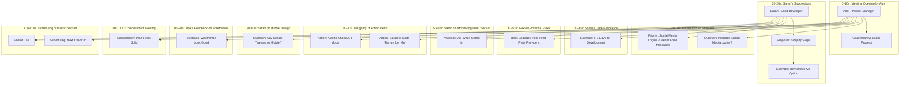

# Meeting Flowchart


```mermaid
```mermaid
graph TB

    subgraph "0-10s: Meeting Opening by Alex"
    A[Alex - Project Manager] --> B[Goal: Improve Login Process]
    end
    
    subgraph "10-20s: Sarah's Suggestions"
    C[Sarah - Lead Developer] --> D[Proposal: Simplify Steps]
    D --> E[Example: Remember Me Option]
    end
    
    subgraph "20-30s: Discussion on Priorities"
    A --> F[Question: Integrate Social Media Logins?]
    C --> G[Priority: Social Media Logins & Better Error Messages]
    end
    
    subgraph "30-40s: Sarah's Time Estimation"
    C --> H[Estimate: 5-7 Days for Development]
    end
    
    subgraph "40-50s: Alex on Potential Risks"
    A --> I[Risk: Changes from Third-Party Providers]
    end
    
    subgraph "50-60s: Sarah on Monitoring and Check-in"
    C --> J[Proposal: Mid-Week Check-In]
    end
    
    subgraph "60-70s: Assigning of Action Items"
    A --> K[Action: Sarah to Code 'Remember Me']
    A --> L[Action: Alex to Check API docs]
    end
    
    subgraph "70-80s: Sarah on Mobile Design"
    C --> M[Question: Any Design Tweaks for Mobile?]
    end
    
    subgraph "80-90s: Alex's Feedback on Wireframes"
    A --> N[Feedback: Wireframes Look Good]
    end
    
    subgraph "90-100s: Conclusion of Meeting"
    C --> O[Confirmation: Plan Feels Solid]
    end
    
    subgraph "100-110s: Scheduling of Next Check-In"
    A --> P[Scheduling: Next Check-In]
    A --> Q[End of Call]
    end
```
```
